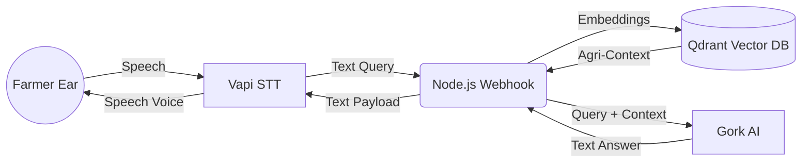

# 🌾 Krishi Voice AI
> **Empowering farmers with instant, intelligent, and native voice assistance for a bountiful harvest.** 

[](https://nodejs.org/)
[](https://vapi.ai/)
[](https://qdrant.tech/)
[](https://x.ai/)

---

## 📌 Problem Statement
Across India, **millions of farmers struggle** to access accurate, timely information regarding government schemes, market prices, and crop disease management. With varying literacy rates and dialect barriers, **text-based portals completely alienate the end-user**. By the time farmers get the right advice, their crops might already be compromised. 

## 💡 Solution
**Krishi Voice AI** is a conversational, voice-first artificial intelligence assistant. By completely removing the need to type, read, or navigate complex apps, farmers can instantly make a phone call or use the web interface to ask questions in **Hindi or Kannada** and receive precise, localized, and context-aware responses in real-time.

## ✨ Key Features
- **🗣️ Voice-First Interaction:** Absolutely no typing required. Speak simply and get answers.
- **🌍 Multilingual Native Support:** Dynamically detects and responds flawlessly in **Hindi** and **Kannada**.
- **⚡ Real-Time Streaming:** Operates with ultra-low latency over both the web and traditional phone networks.
- **🏛️ Scheme Guidance:** Deep-dive into government programs like PM-KISAN effortlessly.
- **🍅 Disease Management:** Intelligent diagnosis and remedy deployment for crop anomalies (e.g., Tomato Early Blight).
- **📉 Market Insights:** Up-to-date and reliable Mandi rates.
- **🧠 Advanced RAG Architecture:** Employs Retrieval-Augmented Generation to ensure zero-hallucinations and factual accuracy based on authentic agriculture data.

---

## 🧠 How It Works
1. **Intake:** The farmer clicks "Start Talking" (or dials a number) and speaks naturally in their native dialect.
2. **Transcription:** Vapi precisely maps the speech to text using localized syntax mapping.
3. **Embeddings:** The query is mathematically transformed using Google Gemini's advanced `embedding-001` model.
4. **Knowledge Retrieval:** Qdrant instantly cross-references the vector against an agriculture knowledge base (RAG).
5. **Generative Processing:** `gemini-2.5-flash-lite` fuses the user's intent with the retrieved context bounds.
6. **Voice Out:** A localized Text-to-Speech (TTS) synthesizes the advice back into clear vocal feedback instantly!

---

## 🏗️ Architecture Diagram


---

## 🛠️ Tech Stack

| Component | Technology | Purpose |
| --- | --- | --- |
| **Frontend** | HTML, CSS, Vanilla JS | Lightweight, robust web graphical interface |
| **Backend** | Node.js, Express | Webhook streaming & centralized orchestration |
| **Voice AI** | Vapi.ai | Ultra-low latency STT and TTS |
| **Database** | Qdrant Cloud | High-speed Vector Semantic Search (RAG) |
| **Generative AI** | Gork ai | Embedding logic & Contextual responses |

---

## ⚙️ Installation & Setup

1. **Clone the repository:**
   ```bash
   git clone https://github.com/Sreddy08840/kirishi-voice-agent.git
   cd kirishi-voice-agent
   ```

2. **Install Backend Dependencies:**
   ```bash
   cd backend
   npm install
   ```

3. **Configure Environment:**
   Create a `.env` file in the `/backend` directory based on the template below.

4. **Seed Database:**
   ```bash
   node testScenarios.js
   ```

5. **Start the Webhook Server:**
   ```bash
   node index.js
   ```

6. **Expose with Ngrok & Start Frontend:**
   ```bash
   ngrok http 3000
   ```
   *Serve the `/frontend` directory using any local development server (e.g., Live Server).*

---

## 🔑 Environment Variables
You must set up your `/backend/.env` file:
```env
PORT=3000
GEMINI_API_KEY=AIzaSy...
QDRANT_URL=https://...
QDRANT_API_KEY=eyJ...
VAPI_API_KEY=your_vapi_secret
```

---

## 🌍 Impact
*Why this matters:*  
Agricultural tech is rarely built for the physical reality of the fields. **Farmers don't have keyboards in the mud.** By adopting seamless voice-technology, Krishi Voice AI actively bridges the technological divide. It equips the backbone of our economy with world-class, multi-billion parameter AI models disguised entirely as a friendly, native conversation.

## 🚀 Future Scope
- **IoT Weather Sensors:** Integration to provide predictive pest warnings based on current soil humidity mapping.
- **WhatsApp Integration:** Delivering the identical voice-node tree via voice notes on WhatsApp.
- **Expanded Languages:** Adding Tamil, Telugu, and Marathi.

---

## 🤝 Contributors
- **[Sreddy08840](https://github.com/Sreddy08840)**

## 📜 License
Distributed under the MIT License. See `LICENSE` for more information.
